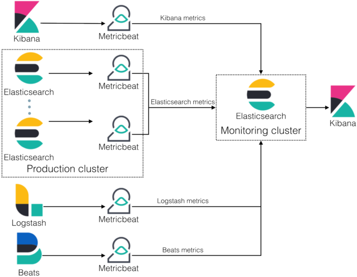

# Mục lục
- Elasticsearch là gì?
- Chi tiết về Elasticsearch là gì? (ES)
- Các công ty lớn đang sử dụng
- Elasticsearch hoạt động như thế nào?
- Tại sao nên sử dụng Elasticsearch?
- Các khái niệm cần biết
	- Document trong Elasticsearch là gì?
	- Index
	- Shard
	- Node
	- Cluster
- Ưu nhược điểm của ES
	-  Ưu điểm
	- Nhược điểm
- Cài đặt ElasticSearch
	- Yêu cầu
	- Cài đặt
- Chạy elasticsearch.
- Sử dụng câu lệnh để truy xuất dữ liệu trên ElasticSearch
- Tài liệu tham khảo Elasticsearch là gì?


# Elasticsearch là gì?

Elasticsearch là gì? – là một công cụ tìm kiếm dựa trên nền tảng Apache Lucene. Nó cung cấp một bộ máy tìm kiếm dạng phân tán, có đầy đủ công cụ với một giao diện web HTTP có hỗ trợ dữ liệu JSON.

# Chi tiết về Elasticsearch là gì? (ES)
- Elasticsearch là một search engine.
- Elasticsearch được kế thừa từ Lucene Apache
- Elasticsearch thực chất hoặt động như 1 web server, có khả năng tìm kiếm nhanh chóng (near realtime) thông qua giao thức RESTful
- Elasticsearch có khả năng phân tích và thống kê dữ liệu
- Elasticsearch chạy trên server riêng và đồng thời giao tiếp thông qua RESTful do vậy nên nó không phụ thuộc vào client viết bằng gì hay hệ thống hiện tại của bạn viết bằng gì. Nên việc tích hợp nó vào hệ thống bạn là dễ dàng, bạn chỉ cần gửi request http lên là nó trả về kết quả.
- Elasticsearch là 1 hệ thống phân tán và có khả năng mở rộng tuyệt vời (horizontal scalability). Lắp thêm node cho nó là nó tự động auto mở rộng cho bạn.
- Elasticsearch là 1 open source được phát triển bằng Java

# Các công ty lớn đang sử dụng
- Wikimedia
- athenahealth
- Adobe Systems
- Facebook
- StumbleUpon Mozilla,
- Amadeus IT Group
- Quora
- Foursquare
- Etsy
- SoundCloud
- GitHub
- FDA
- CERN
- Stack Exchange
- Center for Open Science
- Reverb
- Netflix
- Pixabay
- Motili
- Sophos
- Slurm Workload Manager

# Elasticsearch hoạt động như thế nào?


Sau khái niệm Elasticsearch là gì, thì chúng ta lại tiếp tục tìm hiểu hoạt đông của Elasticsearch, đó là 1 server riêng biệt để “phục vụ” việc tìm kiếm dữ liệu. ES sẽ chạy một cổng (dưới local default là 9200). Người ta cũng có thể dùng ES là DB chính nhưng thường không ai làm thế vì cái gì cũng có nhiệm vụ riêng biệt của nó.

ES không mạnh trong các thao tác CRUD, nên thường sẽ dùng song song với 1 DB chính (SQL, MySQL, MongoDB …)


# Tại sao nên sử dụng Elasticsearch?

Tại sao phải dùng ES trong khi tìm kiếm văn bản có thể sử dụng câu lệnh LIKE SQL cũng được?

Nếu search bằng truy vấn LIKE “%one%” thì kết quả sẽ chỉ cần chứa “one” là ra. Ví dụ: “phone”, “zone”, “money”, “alone” … nói chung sẽ là 1 list kết quả không mong muốn.

Còn search bằng ES thì gõ “one” sẽ chỉ có “one” được trả về mà thôi. Truy vấn LIKE không thể truy vấn từ có dấu. Ví dụ: từ khoá có dấu là “có”, nếu truy vấn LIKE chỉ gõ “co” thì sẽ không trả về được chính xác kết quả Về Perfomance thì ES sẽ là tốt hơn, truy vấn LIKE sẽ tìm kiếm đơn thuần toàn văn bản không sử dụng index, nghĩa là tập dữ liệu càng lớn thì tìm kiếm càng lâu, trong khi ES lại “đánh index” cho các trường được chọn để tìm kiếm.

# Các khái niệm cần biết

## 1. Document trong Elasticsearch là gì?
Document là một JSON object với một số dữ liệu. Đây là basic information unit trong ES. Hiểu 1 cách cơ bản thì đây là đơn vị nhỏ nhất để lưu trữ dữ liệu trong Elasticsearch.

## 2. Index
Index có lẽ là một khái niệm quá quen thuộc đối với các anh em dùng Mysql rồi. Tuy nhiên index trong ES hoàn toàn khác trong Mysql.

Trong Elasticsearch , sử dụng một cấu trúc được gọi là inverted index . Nó được thiết kế để cho phép tìm kiếm full-text search. Cách thức của nó khá đơn giản, các văn bản được phân tách ra thành từng từ có nghĩa sau đó sẽ đk map xem thuộc văn bản nào. Khi search tùy thuộc vào loại search sẽ đưa ra kết quả cụ thể.


VÍ dụ : Chúng ta có 2 văn bản cụ thể như sau :

```
1,The quick brown fox jumped over the lazy dog
2,Quick brown foxes leap over lazy dogs in summer
```

Để tạo ra một inverted index, trước hết chúng ta sẽ phân chia nội dung của từng tài liệu thành các từ riêng biệt (chúng tôi gọi là terms), tạo một danh sách được sắp xếp của tất cả terms duy nhất, sau đó liệt kê tài liệu nào mà mỗi thuật ngữ xuất hiện. Kết quả như sau:
```
Term      Doc_1  Doc_2
-------------------------
Quick   |       |  X
The     |   X   |
brown   |   X   |  X
dog     |   X   |
dogs    |       |  X
fox     |   X   |
foxes   |       |  X
in      |       |  X
jumped  |   X   |
lazy    |   X   |  X
leap    |       |  X
over    |   X   |  X
quick   |   X   |
summer  |       |  X
the     |   X   |
------------------------
```

Bây giờ, nếu chúng ta muốn tìm kiếm màu quick brown, chúng ta chỉ cần tìm trong các tài liệu trong đó mỗi thuật ngữ có xuất xuất hiện hay không. Kết quả như sau:

```
Term      Doc_1  Doc_2
-------------------------
brown   |   X   |  X
quick   |   X   |
------------------------
Total   |   2   |  1
```

Như các bạn đã thấy, cả 2 đoạn văn bản đều thích hợp với từ khóa. Tuy nhiên có thể dễ dàng nhận ra rằng Doc_1 chính xác hơn nhiều.

```
Bạn hoàn toàn có thể setup việc tìm kiếm 1 cách kỹ càng hơn, tuy nhiên minh sẽ đề cập đến vấn đề này trong bài viết sau nhé. Nếu bạn có hứng thú có thể vào tài liệu https://www.elastic.co/guide/en/elasticsearch/guide/current/inverted-index.html và https://www.elastic.co/guide/en/elasticsearch/guide/current/relevance-intro.html#relevance-intro để có cái nhìn rõ ràng hơn .
```



# 3. Shard
- Shard là đối tượng của Lucene , là tập con các documents của 1 Index. Một Index có thể được chia thành nhiều shard.
- Mỗi node bao gồm nhiều Shard . Chính vì thế Shard mà là đối tượng nhỏ nhất, hoạt động ở mức thấp nhất, đóng vai trò lưu trữ dữ liệu.
- Chúng ta gần như không bao giờ làm việc trực tiếp với các Shard vì Elasticsearch đã support toàn bộ việc giao tiếp cũng như tự động thay đổi các Shard khi cần thiết.
- Có 2 loại Shard là : primary shard và replica shard.

## 3.1 : Primary Shard
- Primary Shard là sẽ lưu trữ dữ liệu và đánh index . Sau khi đánh xong dữ liệu sẽ được vận chuyển tới các Replica Shard.
- Mặc định của Elasticsearch là mỗi index sẽ có 5 Primary shard và với mỗiPrimary shard thì sẽ đi kèm với 1 Replica Shard.

## 3.2 : Replica Shard
- Replica Shard đúng như cái tên của nó, nó là nơi lưu trữ dữ liệu nhân bản của Primary Shard
- Replica Shard có vai trò đảm bảo tính toàn vẹn của dữ liệu khi Primary Shardxảy ra vấn đề.
- Ngoài ra Replica Shard có thể giúp tăng cường tốc độ tìm kiếm vì chúng ta có thể setup lượng Replica Shard nhiều hơn mặc định của ES

# 4. Node
- Là trung tâm hoạt động của Elasticsearch. Là nơi lưu trữ dữ liễu ,tham gia thực hiện đánh index cúa cluster cũng như thực hiện các thao tác tìm kiếm
- Mỗi node được định danh bằng 1 unique name

# 5. Cluster

- Tập hợp các nodes hoạt động cùng với nhau, chia sẽ cùng thuộc tính cluster.name. Chính vì thế Cluster sẽ được xác định bằng 1 ‘unique name’. Việc định danh các cluster trùng tên sẽ gây nên lỗi cho các node vì vậy khi setup các bạn cần hết sức chú ý điểm này
- Mỗi cluster có một node chính (master), được lựa chọn một cách tự động và có thể thay thế nếu sự cố xảy ra. Một cluster có thể gồm 1 hoặc nhiều nodes. Các nodes có thể hoạt động trên cùng 1 server .
- Tuy nhiên trong thực tế , một cluster sẽ gồm nhiều nodes hoạt động trên các server khác nhau để đảm bảo nếu 1 server gặp sự cố thì server khác (node khác) có thể hoạt động đầy đủ chức năng so với khi có 2 servers. Các node có thể tìm thấy nhau để hoạt động trên cùng 1 cluster qua giao thức unicast.


```
Chức năng chính của Cluster đó chính là quyết định xem shards nào được phân bổ cho node nào và 
khi nào thì di chuyển các Cluster để cân bằng lại Cluster
```

# Ưu nhược điểm của ES
## Ưu điểm

- Tìm kiếm dữ liệu rất nhanh chóng, mạnh mẽ dựa trên Apache Lucene ( near-realtime searching)
- Có khả năng phân tích dữ liệu (Analysis data)
- Khả năng mở rộng theo chiều ngang tuyệt “vòi”
- Hỗ trợ tìm kiếm mờ (fuzzy), tức là từ khóa tìm kiếm có thể bị sai lỗi chính tả hay không đúng cú pháp thì vẫn có khả năng elasticsearch trả về kết quả tốt.
- Hỗ trợ Structured Query DSL (Domain-Specific Language ), cung cấp việc đặc tả những câu truy vấn phức tạp một cách cụ thể và rõ ràng bằng JSON.
- Hỗ trợ nhiều Elasticsearc client như Java, PhP, Javascript, Ruby, .NET, Python

## Nhược điểm
- Elasticsearch được thiết kế cho mục đích search, do vậy với những nhiệm vụ khác ngoài search như CRUD thì elastic kém thế hơn so với những database khác như Mongodb, Mysql …. Do vậy người ta ít khi dùng elasticsearch làm database chính, mà thường kết hợp nó với 1 database khác.
- Trong elasticsearch không có khái niệm database transaction , tức là nó sẽ không đảm bảo được toàn vẹn dữ liệu trong các hoạt độngInsert, Update, Delete.Tức khi chúng ta thực hiện thay đổi nhiều bản ghi nếu xảy ra lỗi thì sẽ làm cho logic của mình bị sai hay dẫn tới mất mát dữ liệu. Đây cũng là 1 phần khiến elasticsearch không nên là database chính.
- Không thích hợp với những hệ thống thường xuyên cập nhật dữ liệu. Sẽ rất tốn kém cho việc đánh index dữ liệu.


# Cài đặt ElasticSearch

## Yêu cầu
Elasticsearch yêu cầu Java 8 trở lên và phải thiết lập biến môi trường JAVA_HOME cho java, do đó trước khi cài Elasticsearch, hãy chắc chắn rằng bạn đã cài Java version >= 8 trên máy.

Kiểm tra bằng lệnh java -version để biết máy máy mình đã cài Java chưa và phiên bản Java đang cài là bao nhiêu. Kiểm tra biến môi trường JAVA_HOME đã được thiết lập chưa bằng lệnh: echo $JAVA_HOME

## Cài đặt
Download và cài đặt Elasticsearch PGP Key bằng lệnh sau:

```
wget -qO - https://artifacts.elastic.co/GPG-KEY-elasticsearch | sudo apt-key add -
```

Để cài đặt Elasticsearch trên Ubuntu ta có 2 cách là cài từ Repository hoặc cài từ file .deb

**Cách 1: Cách Elasticsearch bằng APT Repository**

Cài gói apt-transport-https

```
sudo apt-get install apt-transport-https
```

Lưu định nghĩa repository vào /etc/apt/sources.list.d/elastic-6.x.list:

(Repository mặc định ko có elasticsearch)

```
echo "deb https://artifacts.elastic.co/packages/6.x/apt stable main" | sudo tee -a /etc/apt/sources.list.d/elastic-6.x.list
```

Cài đặt Elasticsearch bằng lệnh:

```
sudo apt-get update && sudo apt-get install elasticsearch
```

Done!

**Cách 2: cài đặt elasticsearch bằng gói .deb**


Chạy các lệnh dưới đây để tải và cài đặt elasticsearch bằng file .deb
```
wget https://artifacts.elastic.co/downloads/elasticsearch/elasticsearch-6.4.0.deb
wget https://artifacts.elastic.co/downloads/elasticsearch/elasticsearch-6.4.0.deb.sha512
shasum -a 512 -c elasticsearch-6.4.0.deb.sha512 
sudo dpkg -i elasticsearch-6.4.0.deb
```

Done!

# Chạy elasticsearch.
Elasticsearch sau khi được cài đặt sẽ không tự động chạy.

Để khởi động, start, stop elasticsearch ta làm như sau:

Lệnh để chạy server elasticsearch$ sudo systemctl start elasticsearch.service:
```
$ sudo systemctl start elasticsearch.service
```

Lệnh khởi tạo 1 index, mapping trong index đó và 1 document:
```
$ curl -X PUT http://localhost:9200/team/_mapping/member
```

Khởi tạo thành công , màn hình sẽ trả về dòng

```
{"acknowledged":true,"shards_acknowledged":true,"index":"team"}
```


Là khởi tạo thành công index “team”

# Sử dụng câu lệnh để truy xuất dữ liệu trên ElasticSearch
- Lệnh liệt kê các index có trong ES:
```
$ curl -X GET "localhost:9200/_cat/indices?v"
```

- Lệnh tạo document của index: ở đây là thêm member với các trường thuộc tính
```
$ curl -X PUT http://localhost:9200/team/_mapping/member?{&"properties"= {&"id"= { "type": "text" },&"name"= { "type": "text" },&"email"= { "type": "text" },&"age"= { "type": "integer" },&"phone"= { "type": "text" },&"image"= { "type": "text" },&"technologies"= {"type" : "text" }&}&}
```

- Lệnh kiểm tra tất cả index đã khởi tạo:
```
$ curl -X GET http://localhost:9200/team?pretty
```


- Lệnh thêm, sửa dữ liệu vào index trên(team), ở đây là dữ liệu do nhóm em fake ra và insert vào
```
$ curl -X PUT http://localhost:9200/team/member/_bulk?{"create"= { "_id": 1, "_type": "member"}&{"id"= "5510ce4ee174054836ef3c5a","name": "Vargas Rosa","email": "[email protected]","age": 25,"phone": "+1 (807) 530–3567","image": "http://api.randomuser.me/portraits/men/78.jpg","description": "enim Lorem upidatat et nostrud ut irure qui qui nulla qui deserunt fugiat laborum elit","technologies": "ios javascript python"}&{"create"= { "_id": 2, "_type": "member"}&{"id"= "5510ce4e24ecdab88fe18d06","name": "Navarro Thornton","email": "[email protected]","age": 34,"phone": "+1 (896) 579–3364","image": "http://api.randomuser.me/portraits/men/59.jpg","description": "sit enim velit cillum magna commodo tempor","technologies": "swift erlang java"}&{"create"= { "_id": 3, "_type": "member"}&{"id"= "5510ce4e6e7bbdbc120c9a89","name": "Francine Aguirre","email": "[email protected]","age": 30,"phone": "+1 (963) 492–3402","image": "http://api.randomuser.me/portraits/men/82.jpg","description": "cu et sit ullamco tempor Lorem excepteur magna pariatur","technologies": "javascript ionic ruby"}&{"create"= { "_id": 4, "_type": "member"}&{"id"= "5510ce4ebd2a509edd8c6b50","name": "Krystal Simmons","email": "[email protected]","age": 40,"phone": "+1 (857) 418–2040","image": "http://api.randomuser.me/portraits/women/10.jpg","description": "ea dolor ex proident eiusmod et ut irure esse","technologies": "ruby c c"} 
```

- Lệnh hiển thị thông tin các dữ liệu trong document và của từng doccument sau khi đã thêm
```
$ curl -X GET http://localhost:9200/team/member/4?pretty
```

- Lệnh tìm kiếm tất cả dữ liệu các document trong index sử dụng API Search
```
$ curl -X GET http://localhost:9200/_search?pretty=true
```

- Lệnh tìm kiếm theo text nhập ở tất cả các trường trong document , ở đây key search của mình là ruby, đây cũng chính là điểm mạnh của Elasticsearch, nó không giống với query like như thao tác với DB vì nó cần phải nhập đầy đủ text đó ví dụ như ruby ở trên sẽ trả về các document member có text là ruby trong tất cả các field
```
$ curl -X GET http://localhost:9200/_search?q=ruby
```
- Lệnh xóa 1 index
```
 $ curl -X DELETE "localhost:9200/cuongquach-company"
```


# Tài liệu tham khảo Elasticsearch là gì?
Vẫn còn một số các hoạt động, các API để xử lý vào thao tác với Index trong Elasticsearch, nhưng với phần tìm hiểu ở trên về một công cụ mạnh mẽ như elasticsearch là đủ để có thể thao tác, sử dụng và làm quen với elasticsearch. Các bạn có thể tham khảo ở các trang dưới đây.

- https://www.tutorialspoint.com/elasticsearch/elasticsearch_search_apis.htm
- http://www.elasticsearchtutorial.com/elasticsearch-in-5-minutes.html
- https://www.elastic.co/guide/index.html

# Có thể bạn muốn xem thêm:
- Triển khai bộ log tập trung (Centralized logging) với Docker và Kubernetes cho server sử dụng ELK stack
- Cài đặt Jaeger Tracing để theo dõi các services trong một hệ thống Microservice.
- Tips sử dụng elasticsearch | Một vài lưu ý


